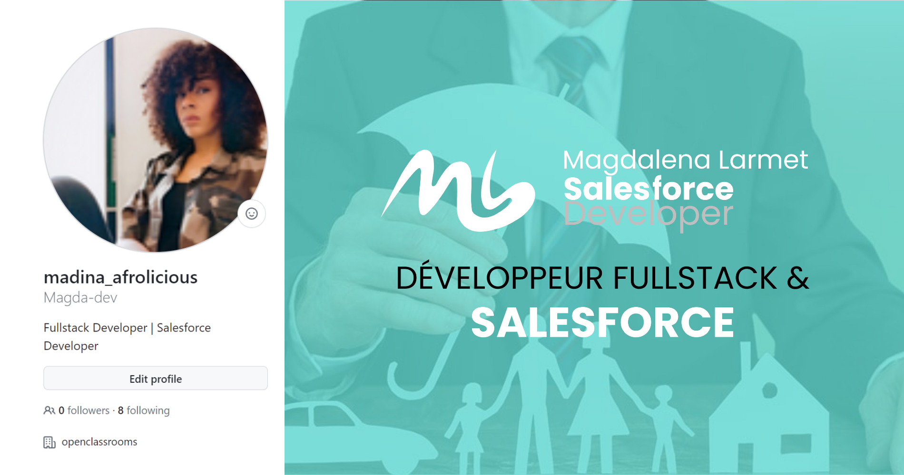

<!-- Improved compatibility of back to top link: See: https://github.com/Magda-dev -->
<a name="readme-top"></a>
<!--
*** Thanks for checking out this Heroku project
*** Don't forget to give the project a star!
*** Thanks again! Now go create your AWESOME Heroku App! :D
-->
<!-- HEADER README -->

<div align="center">
<picture>
  <source media="(prefers-color-scheme: dark)" srcset="https://user-images.githubusercontent.com/25423296/163456776-7f95b81a-f1ed-45f7-b7ab-8fa810d529fa.png">
  <source media="(prefers-color-scheme: light)" srcset="https://user-images.githubusercontent.com/25423296/163456779-a8556205-d0a5-45e2-ac17-42d089e3c3f8.png">
  
</picture>


  <a width="950" height="500" href="https://github.com/Magda-dev/LearnGit">
    
  </a>

  <h1> align="center">Legarant Application Connectée Salesforce</h1>
  

| 👩‍💼Contributors      |📅 Release Date             |🛠    Build              |🧪 Social  |
|:----   |:----:    |:----:    |----:    |
| [](https://www.linkedin.com/in/magdalenalarmet-salesforce-developpeur/)      | [](https://github.com/Magda-dev/Legarant_P12)      |  [](https://github.com/Magda-dev/Legarant_P12)      |   [](https://www.linkedin.com/in/magdalenalarmet-salesforce-developpeur/) |   


<!-- PROJECT SHIELDS -->
<!--
*** I'm using markdown "reference style" links for readability.
*** Reference links are enclosed in brackets [ ] instead of parentheses ( ).
*** See the bottom of this document for the declaration of the reference variables
*** for contributors-url, forks-url, etc. This is an optional, concise syntax you may use.
*** https://www.markdownguide.org/basic-syntax/#reference-style-links
-->
</div>

## About the project
*Author : * Magdalena Larmet

This mobile web application has been completed for Legarant Company. LEGARANT is a life insurance company founded in 1980 and located in Nantes, France. They offer insurance products with several options at competitive prices.

### Technologies and Languages

This is an Salesforce Apex project usine API calls with Postman. It is running on Heroku and use Heroku Connect and Heeroku Postgre to get and insert data into Salesforce. 


## How to deploy the app ?

### Install the app package in your Salesforce org 

Go to Salesforce and create you own regular org or sandbox.
Then simply use the deploy to Salesforce org button to install the package on your own org and follow the 3 steps.</br>

<a href="https://githubsfdeploy.herokuapp.com/?owner=Magda-dev;repo=Legarant_P12">
  
</a>
</br>

Here are some documentation resources to get you started with Salesforce :


#### Configure Your Salesforce DX Project
The `sfdx-project.json` file contains useful configuration information for your project. See [Salesforce DX Project Configuration](https://developer.salesforce.com/docs/atlas.en-us.sfdx_dev.meta/sfdx_dev/sfdx_dev_ws_config.htm) in the _Salesforce DX Developer Guide_ for details about this file.


#### Read more About Salesforce
- [Salesforce Extensions Documentation](https://developer.salesforce.com/tools/vscode/)
- [Salesforce CLI Setup Guide](https://developer.salesforce.com/docs/atlas.en-us.sfdx_setup.meta/sfdx_setup/sfdx_setup_intro.htm)
- [Salesforce DX Developer Guide](https://developer.salesforce.com/docs/atlas.en-us.sfdx_dev.meta/sfdx_dev/sfdx_dev_intro.htm)
- [Salesforce CLI Command Reference](https://developer.salesforce.com/docs/atlas.en-us.sfdx_cli_reference.meta/sfdx_cli_reference/cli_reference.htm)


### Install Postman
You can use the Postman desktop app or the Postman web UI to connect to Salesforce with the Salesforce APIs collection:

<a href="https://www.postman.com/downloads/" target="_blank"></a>

<a href="https://www.youtube.com/watch?v=W-IwW6RM4F0&ab_channel=SalesforceDevelopers">🎥 Video instructions</a></br>
<a href="https://www.postman.com/downloads/">Downloap Postman</a></br>
<a href="https://github.com/forcedotcom/postman-salesforce-apis/blob/master/install-with-app.md#install-the-postman-app">Install the Postman App </a></br>
<a href="https://quickstarts.postman.com/">How to get started with Postman</a></br>

For instructions on how to install and set up Postman please visit : 

🎥 [Video instructions](https://youtu.be/W-IwW6RM4F0)

- [Install the Postman App](https://www.postman.com/downloads/)
- [Fork the Collection](https://learning.postman.com/docs/collaborating-in-postman/using-version-control/forking-entities/)
- [Configure the Collection](https://learning.postman.com/docs/getting-started/installation/settings/)
- [Execute a Request](https://academy.postman.com/requests-and-responses-basics)

See [additional documentation](https://academy.postman.com/) to learn how to use Postman.


### Connect and deploy The app with Heroku in a few clicks

Sign in to a paid account on Heroku to get started. 
In this app Contact and Contract object are used and mapped in Heroku.
Only Heroku Postgre (paid) and Heroku Connect add-ons are needed (Free version).</br>

For simple deployment on Heroku platform use this handy Heroku-button 
[](https://heroku.com/deploy?template=https://github.com/Magda-dev/Legarant_P12)

## Command lines for Heroku
```
$ heroku create
$ git push heroku main
$ heroku open
```

Now you are all set to try out the app ! 
